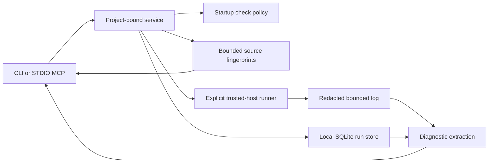

# Architecture

Adapters call one core service. There is no provider API, embedding index, HTTP listener, background telemetry, or automatic tool registration. The optional MCP dependency is isolated in its adapter.

The SQLite lease prevents overlapping check runs for the same project. An expired run is marked interrupted when the next run acquires the lease. A lease is concurrency control, not a guarantee that a crashed process's descendants have stopped. Commands are sequential; process cleanup on timeout is best effort and must not be represented as isolation.

Source hashes contain no source text. Policy digests include the resolved executable and argv. Environment fingerprints include server interpreter/version, installed distributions, platform description, and the filtered child environment. They do not identify every external influence on a tool.

Stored logs are bounded and redacted before persistence. Returned summaries include links by run ID, check name, and stored-log line. Comparisons use sampled exact-text diagnostics, with explicit scope. They do not prove all failures have been resolved.

Decisions: no automatic cached success; no arbitrary argv MCP tool; default read-only server; no guessed test-impact graph; no LLM summarizer in the first release. These keep the baseline deterministic and measurable.
